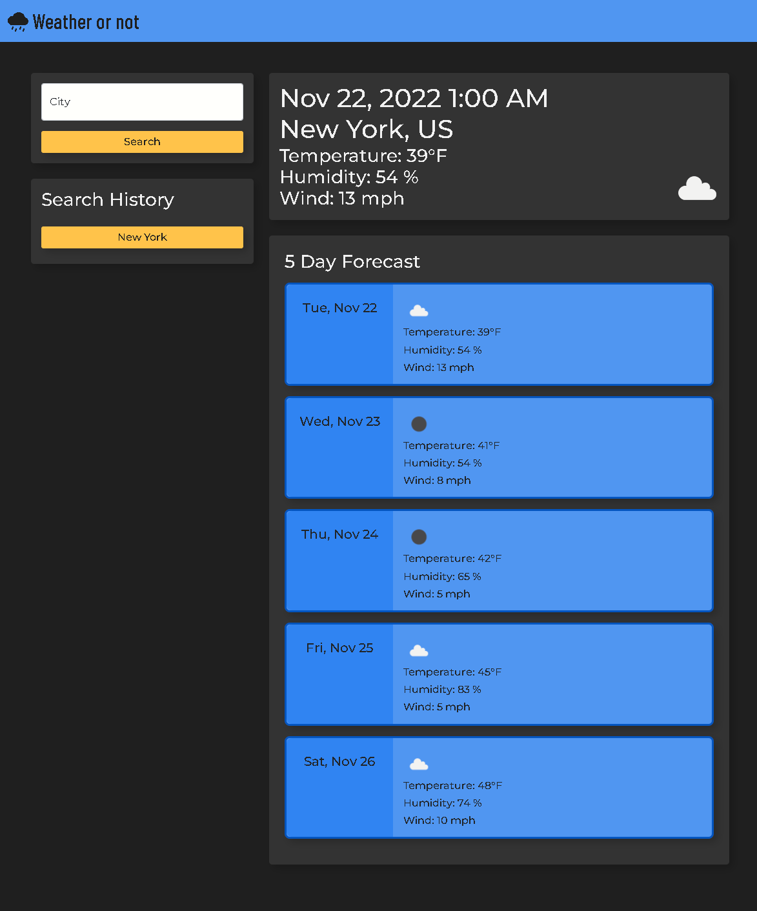

# Weather or Not

## Description

A fast, mobile responsive weather application

- My goal here was to make a very quick and simple weather app
- I wanted this app to store the recent places I've searched for
- It allows o the user to quickly check the weather in a variety of places in real time

## Installation

What are the steps required to install your project? Provide a step-by-step description of how to get the development environment running.

## Usage

To use this application visit the following link: [Weather or Not](https://tooboi.github.io/Weather-Dashboard/)

## License

[MIT License](./LICENSE)

## Technologies

- Bootstrap
- Open Weather API
- Dayjs
